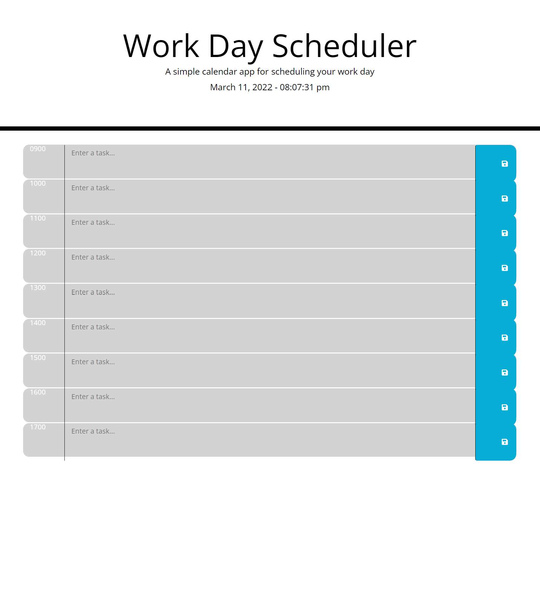

# Work Day Scheduler

## Table of Contents
### General Info
### Technologies
### Setup
### Screenshot

## General info
This is a simple web-based application to keep track of tasks during a standard business day. The current day is displayed at the top of the calendar. When the user scrolls down they are presented with time blocks for standard business hours. Each time block is color-coded to indicate whether it is in the past, present, or future. When a user clicks into a time block they can enter an event. When the user clicks the save button for that time block the text for that event is saved in local storage. When the user refreshes the page the saved event persists.

## Technologies
Project is modified with:
* Visual Studio Code Version: 1.64.0 (user setup)
* OS: Windows_NT x64 10.0.22543
* css
* bootstrap
* fontawesome
* google fonts
* jQuery
* moment.js

## Setup
To launch the page click on the link provided below

Link to deployed location:
https://kevin-foreman.github.io/work-day-scheduler/

* Screenshot of landing page

